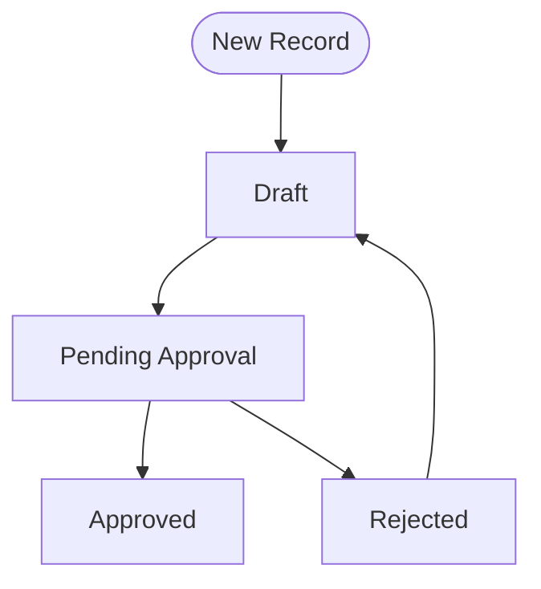

Design a complete Frappe custom module — DocType map, field schema, workflow map, script inventory, and phased build plan — before writing any code.

## Pre-Flight Questions

1. **Business problem being solved?** (What manual process does this replace?)
2. **Key entities/objects?** (What are the "nouns" — things being tracked?)
3. **Key processes/actions?** (What are the "verbs" — approvals, calculations, notifications?)
4. **Who uses it?** (Roles: creator, approver, viewer, admin)
5. **Integration with ERPNext?** (Links to Lead, Customer, Sales Order, etc.)
6. **Timeline?** (MVP vs. full build)

---

## Step-by-Step Instructions

### 1. Module Design Document Template

```markdown
# [Module Name] — Design Document

**Version:** 0.1 (Draft)
**Date:** YYYY-MM-DD
**Author:** [Name]

---

## Business Context

[1-2 paragraphs: what problem this solves, what it replaces, who benefits]

---

## Module Scope

### In Scope
- [Feature 1]
- [Feature 2]

### Out of Scope (v1)
- [Deferred feature]

---

## Entity Map

```
[DocType A] ──has many──> [DocType B (child)]
[DocType A] ──links to──> [ERPNext Lead]
[DocType A] ──triggers──> [DocType C (approval)]
```

---

## DocType Inventory

| DocType | Type | Submittable | Purpose |
|---------|------|-------------|---------|
| [Name] | Standard | Yes/No | [Purpose] |
| [Name] | Child | No | [Purpose] |

---

## Key Fields (per DocType)

### [DocType Name]

| Field | Type | Options/Link | Required | Notes |
|-------|------|-------------|---------|-------|
| name | Data | — | Auto | Frappe auto-generates |
| status | Select | Draft\nApproved\nRejected | Yes | Workflow state |
| linked_lead | Link | Lead | No | ERPNext integration |
| items | Table | [Child DocType] | Yes | Line items |

---

## Workflow Map



### Workflow Transitions

| From | Action | To | Allowed Role | Condition |
|------|--------|----|-------------|-----------|
| Draft | Submit | Pending Approval | [Role] | items not empty |
| Pending Approval | Approve | Approved | [Approver Role] | — |
| Pending Approval | Reject | Rejected | [Approver Role] | — |
| Rejected | Revise | Draft | [Role] | — |

---

## Script Inventory

| Script Name | Type | Trigger | Purpose |
|-------------|------|---------|---------|
| [Name]-AfterSubmit | Server Script (DocEvent) | After Submit | Route to approver |
| [Name]-API-Decision | Server Script (API) | API call | Record decision |
| [Name]-Daily-Reminder | Server Script (Scheduler) | Daily | Email pending approvals |
| [Name]-Form | Client Script | Form events | UI logic |

---

## Custom Fields on Existing DocTypes

| DocType | Field | Type | Purpose |
|---------|-------|------|---------|
| Lead | [fieldname] | [type] | [purpose] |

---

## Roles Required

| Role | Permissions | Description |
|------|-------------|-------------|
| [Role Name] | Read, Write, Create on [DocType] | Can create requests |
| [Approver Role] | Read, Write, Submit on [DocType] | Can approve/reject |

---

## Fixtures (hooks.py)

```python
fixtures = [
    "Role",
    "Workflow State",
    "Workflow Action",
    {"dt": "Workflow", "filters": [["name", "=", "[Workflow Name]"]]},
    {"dt": "Custom Field", "filters": [["dt", "in", ["Lead"]]]},
]
```

---

## Phased Build Plan

### Phase 1 — MVP (Week 1)
- [ ] DocType: [Name] with core fields
- [ ] Workflow: Draft → Approved/Rejected
- [ ] Client Script: basic form validation
- [ ] Role: [Role Name]

### Phase 2 — Automation (Week 2)
- [ ] Server Script: AfterSubmit routing
- [ ] Server Script: Daily reminder
- [ ] Email templates

### Phase 3 — Integration (Week 3)
- [ ] Custom fields on Lead/Customer
- [ ] Report: [Report Name]
- [ ] Portal page (if needed)

---

## Risk / Dependency Notes

- [Risk 1]: [mitigation]
- [Dependency]: [what must exist before this can work]
```

### 2. DocType Field Schema Quick-Reference

When planning fields, use these Frappe types:

| Data | Short text, free-form |
|------|-----------------------|
| Text / Text Editor | Long text, HTML |
| Int / Float / Currency | Numbers |
| Select | Dropdown with fixed options |
| Link | Foreign key to another DocType |
| Table | Child table (repeating rows) |
| Date / Datetime | Date pickers |
| Check | Boolean checkbox |
| Attach | File upload |
| Section Break / Column Break | Layout dividers |

### 3. Naming Convention (for this workspace)

- **DocType:** Title Case (`Network Sales Score`)
- **Fieldname:** snake_case (`total_amount`)
- **Custom fields (Frappe v14+):** prefix `custom_` auto-added
- **Server Scripts:** `[APP]-SS-[DocType/Purpose]-[Event]` (e.g., `PLA-SS-NSS-AfterSubmit`)
- **Client Scripts:** `[APP]-CS-[DocType]-Form` (e.g., `PLA-CS-NSS-Form`)
- **API Scripts:** `[APP]-API-[Function]` (e.g., `PLA-API-NSS-Decision`)

---

## Context Anchor

- **User:** Solo Process Engineer — designs processes first, then builds in Frappe
- **Plan before code:** A 30-minute design session prevents 3 hours of rework
- **Phase 1 = MVP** — resist the urge to build everything; prove the core flow first
- **Naming conventions matter** — consistent names make scripts scannable without opening them
- **Always draw the workflow diagram** before writing a single line of script
- **Check ERPNext integration early** — linking to Lead/Customer affects field dependencies
